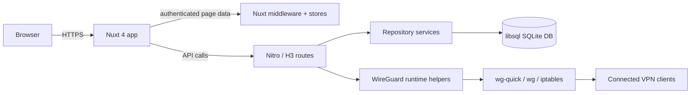

# System Architecture

## Request Flow

## Main Layers

| Layer       | Responsibility                                                                                                  |
| ----------- | --------------------------------------------------------------------------------------------------------------- |
| Frontend    | File-based pages, shared layouts, reusable UI components, stores, and route middleware under `src/app`          |
| API         | Nitro route handlers under `src/server/api` and public routes under `src/server/routes`                         |
| Data access | Drizzle-backed repository services under `src/server/database/repositories`                                     |
| VPN runtime | `src/server/utils/WireGuard.ts`, `wgHelper.ts`, and `firewall.ts` render config, manage sync, and rebuild rules |
| CLI         | Bundled admin commands in `src/cli` and `src/cli/build.js`                                                      |
| Docs        | Zensical docs site under `docs/content`                                                                         |

## Frontend Architecture

The frontend is a Nuxt 4 app with Vue 3 components and Pinia stores.

| Element        | Notes                                                                                                                              |
| -------------- | ---------------------------------------------------------------------------------------------------------------------------------- |
| Routing        | File-based routes in `src/app/pages`, including `/`, `/login`, `/login/2fa`, `/me`, `/clients/[id]`, `/admin/*`, and `/setup/*`    |
| Middleware     | `src/app/middleware/auth.global.ts` loads session state, redirects unauthenticated users, and blocks non-admin users from `/admin` |
| State          | Stores for auth, clients, global app state, setup, and toast notifications                                                         |
| UI library     | Tailwind CSS, Radix Vue, and a set of base/form/panel components                                                                   |
| Responsiveness | Views are designed to work on mobile and desktop; auth and client pages use compact panel layouts                                  |
| Localization   | 24 locales are configured in `src/nuxt.config.ts`; the default locale is `en`                                                      |

## Backend Architecture

The backend runs in Nitro and exposes HTTP routes plus a small public metrics surface.

| Area              | Examples                                                                                                        |
| ----------------- | --------------------------------------------------------------------------------------------------------------- |
| Auth              | `/api/session`, `/api/auth/*`, `/api/me/*`                                                                      |
| Admin             | `/api/admin/general`, `/api/admin/hooks`, `/api/admin/interface`, `/api/admin/userconfig`, `/api/admin/ip-info` |
| Client management | `/api/client/*` for CRUD, config, QR, enable/disable, and one-time link generation                              |
| Setup             | `/api/setup/*` and `/api/setup/migrate`                                                                         |
| Public downloads  | `/cnf/[oneTimeLink]`                                                                                            |
| Metrics           | `/metrics/json` and `/metrics/prometheus`                                                                       |

Route bodies and most params use shared Zod schemas. OAuth provider params use an explicit allow-list. Permission-aware handlers are used for admin and metrics access.

## Database Model

SQLite is the source of truth. The DB file lives at `/etc/wireguard/wg-easy.db`, and Drizzle manages schema plus migrations.

| Table / repository     | Purpose                                                                               |
| ---------------------- | ------------------------------------------------------------------------------------- |
| `users_table`          | User profile, password hash, TOTP state, OAuth metadata                               |
| `interfaces_table`     | WireGuard interface settings, device name, port, MTU, AmneziaWG values, firewall flag |
| `clients_table`        | Client keys, addresses, hooks, DNS, firewall IPs, keepalive, expiry                   |
| `general_table`        | Setup step, session config, metrics config, and bandwidth settings                    |
| `hooks_table`          | Interface pre/post up/down hooks                                                      |
| `one_time_links_table` | Temporary download links for client config                                            |
| `user_configs_table`   | Per-interface defaults for new clients                                                |

Bandwidth settings are stored in `general_table` and exposed through `Database.general.getConfig()` and `POST /api/admin/general`, but no code path enforces traffic shaping at runtime.

## Runtime Lifecycle

| Stage        | What happens                                                                                                                                                                       |
| ------------ | ---------------------------------------------------------------------------------------------------------------------------------------------------------------------------------- |
| Boot         | `src/server/utils/Database.ts` connects first, then calls `WireGuard.Startup()`                                                                                                    |
| Startup      | `WireGuard.Startup()` generates default keys when needed, writes `/etc/wireguard/{iface}.conf`, runs `wg-quick up`, syncs config, applies firewall rules, and starts the cron loop |
| Steady state | UI refreshes client state by polling; metrics endpoints read live WireGuard dump data                                                                                              |
| Shutdown     | `src/server/plugins/manager.ts` hooks Nitro `close` and calls `WireGuard.Shutdown()`                                                                                               |
| Cron         | Every minute, expired clients are disabled and expired one-time links are deleted                                                                                                  |

## Security Boundaries

| Boundary   | Protection                                                                                                       |
| ---------- | ---------------------------------------------------------------------------------------------------------------- |
| Auth       | Session-based login, OAuth options, TOTP verification, pending-login handling                                    |
| Input      | Shared validation helpers and Zod schemas on route input                                                         |
| Secrets    | Password hashes use Argon2; metrics passwords are hashed if the incoming value is not already a hash             |
| Network    | Docker container runs with `NET_ADMIN` and `SYS_MODULE` only because WireGuard and firewall management need them |
| Filesystem | WireGuard config is written with restrictive permissions and the DB is isolated in the WireGuard volume          |

## Deployment View

The runtime image is built with Docker, then starts `node server/index.mjs` under `dumb-init`. Compose mounts `/etc/wireguard`, `/lib/modules`, and exposes UDP 51820 plus TCP 51821 by default.
